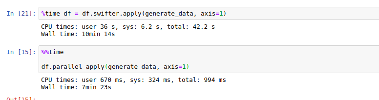

# code-20210602-qaisqadri

# BMI calculator along with the tests

## Python BMI Calculator Coding Challenge
Problem Statement
Given the following JSON data
`[{"Gender": "Male", "HeightCm": 171, "WeightKg": 96 }, { "Gender": "Male", "HeightCm": 161, "WeightKg":
85 }, { "Gender": "Male", "HeightCm": 180, "WeightKg": 77 }, { "Gender": "Female", "HeightCm": 166,
"WeightKg": 62}, {"Gender": "Female", "HeightCm": 150, "WeightKg": 70}, {"Gender": "Female",
"HeightCm": 167, "WeightKg": 82}]` ​ as the input with weight and height parameters of a person,
we have to perform the following:

- Calculate the BMI (Body Mass Index) using ​ Formula 1​ , BMI Category and Health
risk ​ from Table 1​ of the person and add them as 3 new columns
- Count the total number of overweight people using ranges in the column BMI
Category of ​ Table 1,​ check this is consistent programmatically and add any other
observations in the documentation
- Create build, tests to make sure the code is working as expected and this can be
added to an automation build / test / deployment pipeline

### Prerequisites:
- python 3.6 or greater
- python dependencies like pandas etc which are in requirements.txt

### Steps:

- clone the repo
- setup virutal env and install python dependencies with **pip install -r requirements.txt**
- next we have give in the path to the json file and the result type in the calculate_bmi.py (at the end)
- There is also parallelize option which is discussed below.

## Working:
For the First and Second Point, [calculate_bmi.py](calculate_bmi.py) contains
The py file contains:
- MAPPING which is the mapping of range of BMI values and their relation with the BMI category and Health Risk.
- 6 functions which break down the problems and solve step by step in function named main.
For the Thrid The Test point, the Test cases are written in [test_calculate_bmi.py](calculate_bmi.py) and pytest is used for these.

## For the Question of Larger Json and Scaling up and parallelization
For the purpose of larger data and scaling up, I suggest the parallelization approach at the first, i.e to to parallelize the computation across multiple cores (on same machine) and speed up accordingly. Since I have used Pandas which is capable of handling (as mentioned 1 lac, and even more), memory wise but the computation as seen was slower (~ 30 mins) for 6 lac records. So I suggest parallelizing on the pandas dataframe and for that I have previously worked with Pandarallel and swifter, though I like pandarallel more due its simplicity.

I have also added the bit to parallelize the most critical function (generate_data) over the DataFrame using pandarallel and for that one has to set the setting variable at line 5 in calculate_bmi.py to True. But Please Note this should be done only in case of larger data, otherwise for smaller data it will bring performance drop instead.

A comparsion of pandarallel and swifter for 6 lac records for the generate_data function is dipicted below

reference:
pandarallel https://github.com/nalepae/pandarallel
swifter https://github.com/jmcarpenter2/swifter

